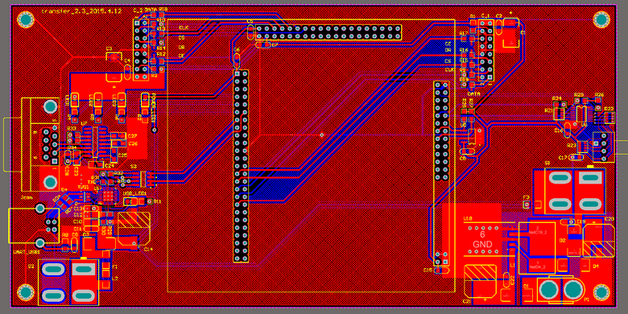
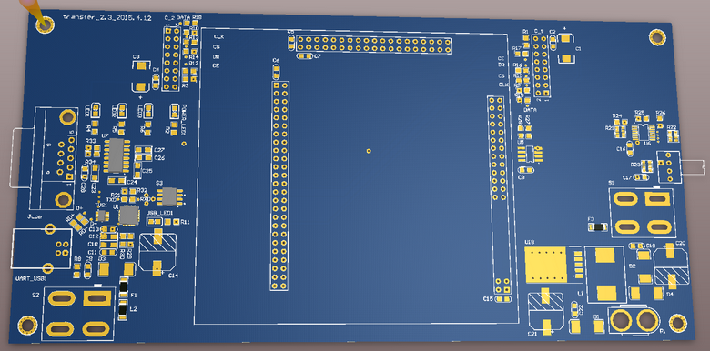
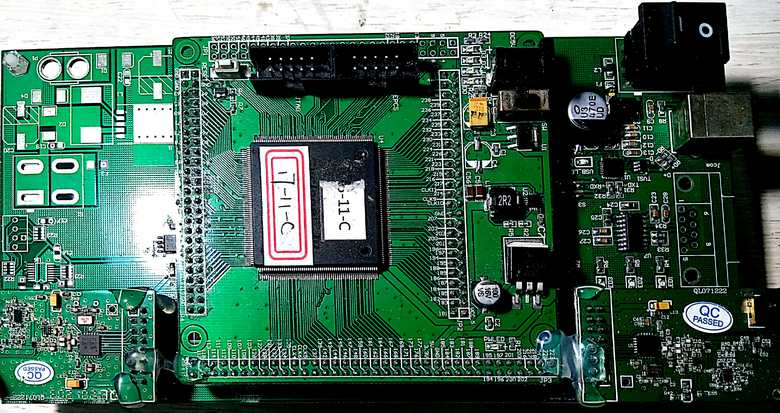

# ZJUNlict Transmitter Description

The transmitter contains the interface to PC using virtual serial port [CP2102](https://www.silabs.com/documents/public/data-sheets/CP2102-9.pdf), [core board](https://github.com/ZJUNlict/Core_Board) and two [nRF2401A](https://www.nordicsemi.com/eng/Products/2.4GHz-RF/nRF2401A) modules. (The board is designed using [Altium Designer](https://www.altium.com/altium-designer/) 17.1)

The 2D and 3D design views are shown below:

The main features are:

* Support traditional RS232 DB9 interface (MAX3232) and USB virtual serial port interface based on [CP2102](https://www.silabs.com/documents/public/data-sheets/CP2102-9.pdf). FPGA firmware can be found in corresponding [firmware repository](https://github.com/ZJUNlict/Firmware_for_Transmitter).
* Two connectors for nRF2401A modules.
* I/O expander (PCA9557PW) and rotary DIP switch (A6R/A6RV) for easier transmitter frequency set.
* Support both USB and battery power supply

The photo of the transmitter board is shown below as references. 

